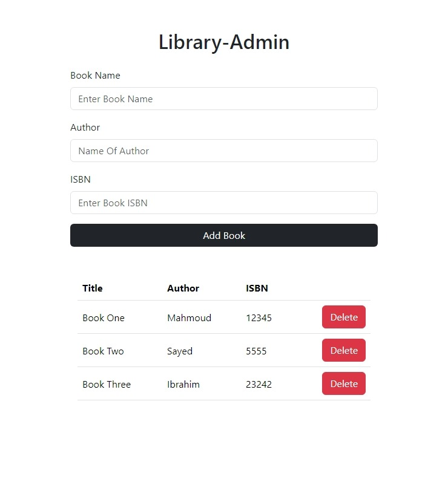

# Library-Admin

An app built with OOP architecture that helps library admin manage the library.

## Table of contents

- [Overview](#overview)
  - [The Library-Admin features](#the-Library-Admin-features)
  - [Screenshot](#screenshot)
  - [Links](#links)
- [My process](#my-process)
  - [Built with](#built-with)
  - [What I learned](#what-i-learned)
- [Author](#author)

## Overview

### The Library-Admin features

Users should be able to:

- Add book to the Books list
- Delete the book from the list
- See the alert if you want to add a book with uncompleted fields
- Save and delete to local storage to keep the list even when reloading the page

### Screenshot

- Desktop view

### Links

- Live Site URL : [Library-Admin](https://mahmoudsmohammed.github.io/Library-Admin/)

## My process

### Built with

- HTML 5
- CSS 3
- Bootstrap 5
- JavaScript
- Es6 Classes

### What I learned

- How structure the project files.
- Using Git and Github.
- Using Bootstrap Which Saves A lot Of Time 
- OOP Design The app is based on Classes and Objects
- Prototype Chain and Prototype Inheritance
- How to Manipulate Dom With JavaScript

## Author

- Linkedin - [Mahmoud Sayed](https://www.linkedin.com/in/mahmoud-sayed-b85536217/)
- Codewars - [@MahmoudsMohammed](https://www.codewars.com/users/MahmoudsMohammed)
